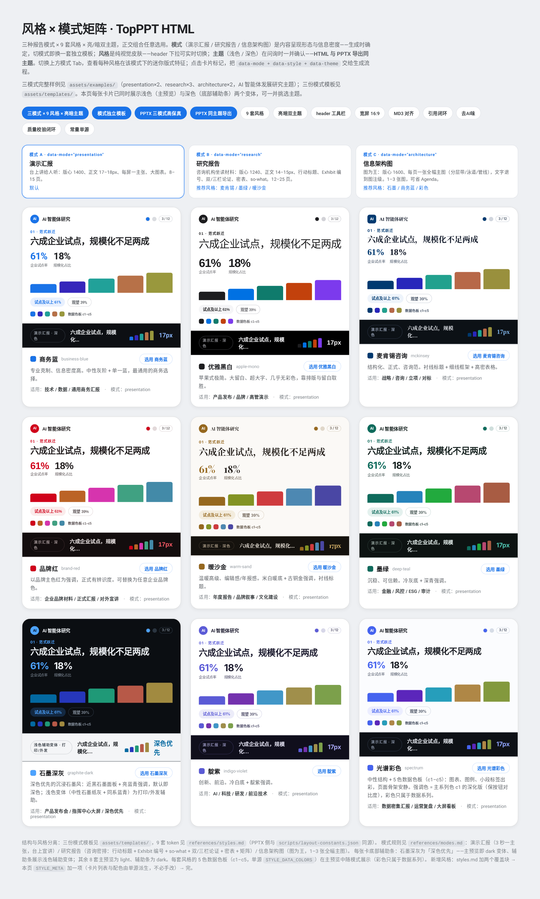

# topmind-presentation · TopPPT HTML

**[中文](./README.md)** | English

[](https://github.com/topmindspace/topmind-presentation/releases)
[](https://www.npmjs.com/package/@topmindspace/topmind-presentation)
[](https://github.com/topmindspace/topmind-presentation/actions/workflows/ci.yml)
[](LICENSE)

**Let ideas fly — make good thinking visible.** A high-craft skill for **demo reports / formal business presentations**: **HTML + PPT dual delivery** — day-to-day, present with paginated HTML like slides; export **layout-faithful editable PPTX** when needed. **MD3-inspired**: fitting information density, restrained type / shapes / color. Core craft is layout, typography, color, and content structure — not gadget soup.

- Skill id: `topmind-presentation`; brand: **TopPPT HTML**
- Version: **v0.2.2** (standalone repo, independently versioned)
- **Agent entry**: `SKILL.md` → `references/playbook.md` (L1) → L2 on demand
- **Human maintainers**: this README (install / commands / layout); do not treat it as the generation spec
- The repo is the skill: the repo root is the skill body (SKILL.md + assets + references + scripts)

### Theme overview (Gate 0)

<p align="center">
  <br/>
  <sub>Presentation · business-blue (default) · also <a href="./assets/style-gallery.html">style-gallery</a> · <a href="./assets/theme-overview-research.png">research</a> · <a href="./assets/theme-overview-architecture.png">architecture</a></sub>
</p>

**Live** · [Landing](https://topmindspace.github.io/topmind-presentation/) · [Showcase deck](https://topmindspace.github.io/topmind-presentation/showcase.html) · [Style gallery](https://topmindspace.github.io/topmind-presentation/style-gallery.html)

- In-repo gallery: [`assets/style-gallery.html`](./assets/style-gallery.html)
- Product showcase: [`assets/examples/2026-09-26-topmind-tms-skills-showcase.html`](./assets/examples/2026-09-26-topmind-tms-skills-showcase.html) (Mode A · dual-delivery narrative · **5 chart types** · toolbar page)
- Repo shot pack: [`docs/showcase/`](./docs/showcase/)

## Skill snapshot

| Dimension | Capability |
|-----------|------------|
| Output | Single-file HTML (paginated, light/dark, **header toolbar T/P/H/F/B + 9 styles**) + 16:9 editable PPTX |
| Positioning | Formal business · dual delivery · MD3-inspired density |
| Modes | A Presentation · B Research · C Architecture |
| Styles | 9 packs (`styles.md`) |
| Charts | Core 8 by default + full registry; variety / anti-truncation / Mode A craft |
| Quality | `validate_report --strict` · `validate_pptx --strict` · `quality_gate --deliver` |

## HTML header toolbar

| Control | Shortcut | Behavior |
|---------|----------|----------|
| Theme toggle | **T** | Light / dark; per-file memory; syncs `REPORT_MODEL.theme` |
| Style picker | 9 styles | Live visual skins; write back `REPORT_MODEL.style` before deliver |
| PPTX preview | **P** | WYSIWYG sequence + copyable agent prompt |
| Generation guide | **H** | Dual-channel + environment notes |
| Fullscreen | **F** | Immersive present |
| Collapse toolbar | **B** | Mini bar; remembers per file |

Also: arrow-key paging; **Esc** closes modals. After style/theme change, re-run `validate_report --strict` (do not rewrite content).

## Install

The repo is the skill: copy the repo root (or the `topmind-presentation.zip` from a GitHub Release) into your agent's skills directory, keeping the folder name `topmind-presentation`. The skill surface is `SKILL.md` (`name` / `description` in frontmatter drive triggering).

```bash
# track HEAD
git clone https://github.com/topmindspace/topmind-presentation.git
cp -r topmind-presentation ~/.claude/skills/topmind-presentation

# or pin a version: download topmind-presentation.zip from the Release page
```

The npm package [`@topmindspace/topmind-presentation`](https://www.npmjs.com/package/@topmindspace/topmind-presentation) is published in sync with GitHub tags when needed.

> Do not `npm install topmind-presentation` (the skill id is not a standalone npm package).

PPTX needs `npm install` in this folder (pptxgenjs). HTML generation: Python stdlib only.

### Minimal example (~3 min)

```bash
cd topmind-presentation
python3 scripts/scaffold_report.py --mode research --style mckinsey \
  --title "Sample report" --sections 8 --out report.html
# Open report.html, fill in window.REPORT_MODEL only (single source of truth), then:
python3 scripts/render_from_model.py report.html --inplace
python3 scripts/validate_report.py report.html --strict   # ship only at 0 errors / 0 warnings
# For PPTX (after npm install):
python3 scripts/extract_model.py report.html report.model.json
node scripts/build_pptx.js report.pptx --model=report.model.json
python3 scripts/validate_pptx.py report.pptx --strict --model=report.model.json
```

Swap modes: `--mode presentation --style business-blue` (A) / `--mode architecture --style graphite-dark` (C).

Full Chinese maintainer docs (directory map, command cookbook): see [`README.md`](./README.md). Agent rules live in `SKILL.md` / `playbook.md`.

## License

MIT © TopMindspace — [LICENSE](./LICENSE)
